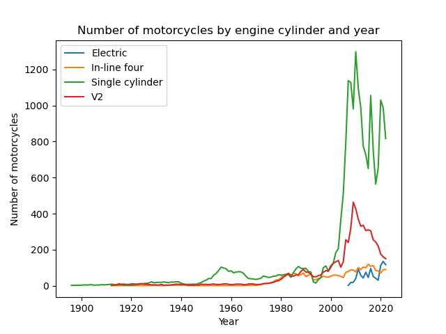
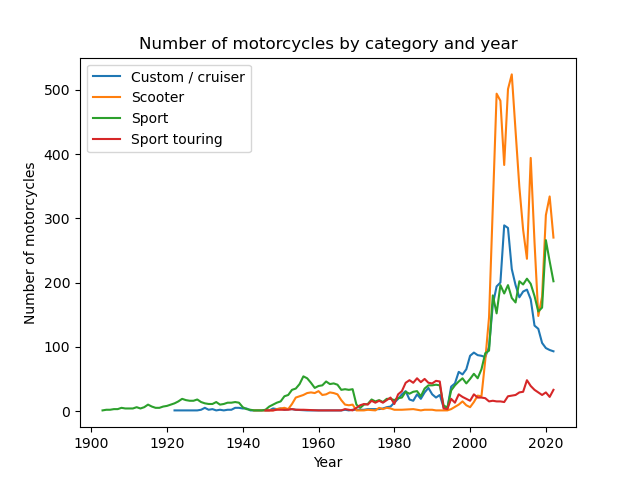
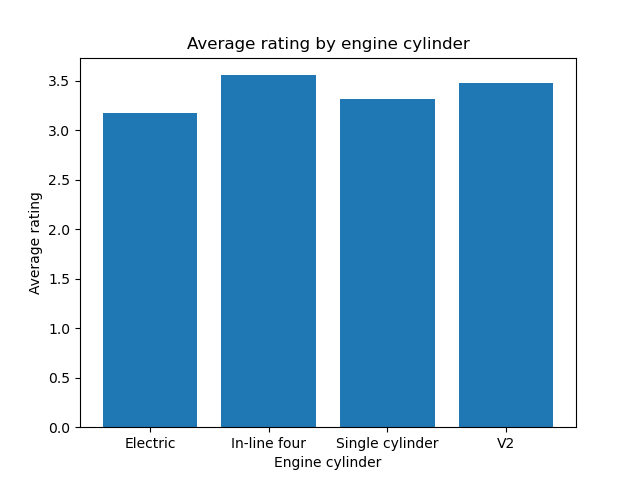
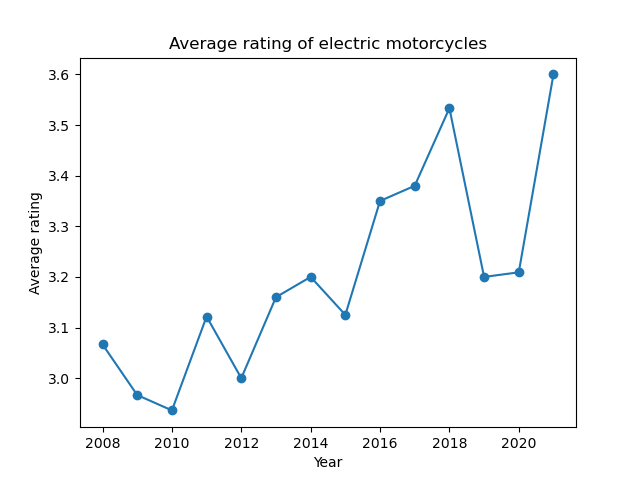

```{r setup, include=FALSE}
knitr::opts_chunk$set(echo = TRUE)
```
---------------------------------------------
#### Introductory note
The source code of the resulting visualisations is available in separate files located "Code" folder. All graphs were prepared using Python and the libraries 'Matplotlib.pyplot' and 'Pandas', while the report was generated by R Markdown.

## Introduction
  Because of my interest in motorbikes and data analysis, I decided to search the internet for a data frame on motorbikes. I found the data on the website kaggle.com and put the data frame itself together with the report in one directory.
  In the data frame, we can find a lot of information such as: Brand, Motorcycle model, year of production and much more. In this report, I will try to give you an idea of how the motorbike industry is growing and what you can initially expect from it.

### What is most common?

To begin with, lets look at the development of the various engine types over the last decade or so. We will only be interested in 'In-line four', 'V2', 'Single cylinder' and 'Electric' engines. The first three are the most basic engine types. The so-called "electrics", on the other hand, are particularly important to me because they are the future of motoring. I have drawn up the following graph to visualise the development of motorbikes with these engine types:

<div style="text-align:center"></div>

We can observe, as a result, that the most dominant group is the 'Single cylinder' engine. Electric engines, on the other hand, have started to overtake the 'In-line four' and are almost catching up with the production of 'V2' engines. This is certainly a good step towards greener motorbikes. One may wonder why this is happening. This is clearly a good question, so that we can move smoothly on to the next graph showing how the production of motorcycles has changed according to their category:

<div style="text-align:center"></div>

Having analysed the graph above, we can safely conclude that scooters have taken over the roads. No wonder. They are even more compact, do not need a driving licence, and are cheaper to buy and use. The increase in scooter production may be one of the reasons why the popularity of "electrics" has grown so much. But let's keep our fingers crossed that we will also see worthy replacements in other categories. However, why are they so highly expected? 

### Why "electrics"?

As a big fan of new technology, I eagerly await newer and more surprising initiatives from manufacturers. But are they that good compared to 'normal' motorbikes? In the data frame we are using, there is also a 'Rating' column, which contains user ratings from 1 to 5. Let's see what average rating our motorcycles receive. We will focus on separate categories. 

<div style="text-align:center"></div>

As we can see, the differences in the average rating are not large. Of course, there are differences, but it is safe to say that these differences are not very significant, since an important factor in rating a motorbike is also the personal attitude which will ultimately guide us anyway. What might interest us instead is the change in the average rating over the years. At this point, we will only be looking at motorcycles with electric motors and, by analysing the graph below, we can clearly see an upward trend.

<div style="text-align:center"></div>

### Summation

After analysing all the graphs, we can safely say that electric motorbikes are getting better and better and that they are becoming more and more common on the roads. Electric motorbikes are something to be interested in for a number of reasons. One is, of course, the increasing average user rating and the other is that they are increasingly being chosen as a means of transport.

## Conclusion 

Although the data frame we have used is small it is a good representation of the problem we are addressing. Analysis of this frame can give us small but in the long game important clues about where the motorbike market will go and what we can expect in the next few years. Clearly we will experience an increase in the production of electric motorcycles, which will overtake most of the less significant engine types.

